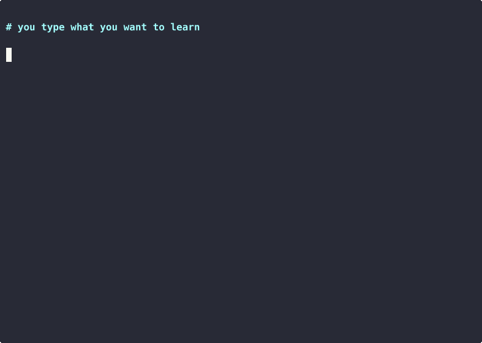

# learn-by-building: learn any topic by shipping 5 tiny projects

A Claude Code skill that runs Karpathy's expert method on any topic you name. The whole method is one 84-line markdown file.



AI course generators hand you chapters to read. Reading feels like progress, but it doesn't stick. Karpathy's advice for becoming an expert is different: build concrete projects and learn on demand, teach back what you learned in your own words, and compare yourself only to your younger self. This skill turns any Claude Code session into that loop.

## Quickstart

```bash
git clone https://github.com/reezanahamed/learn-by-building.git
cp -r learn-by-building ~/.claude/skills/
claude
```

Then type what you want to learn. Anything works:

```
> I want to learn how rockets work
> I want to learn Monte Carlo simulation
> I want to learn C++
```

## What it does

| Feature | What you get |
|---|---|
| Project ladder | 5 concrete projects, easiest to hardest, each sized for a laptop and free tools |
| On-demand teaching | Claude explains only what the current step needs. No lectures, no chapter 1 |
| Teach-back gates | You explain each project in your own words, then survive 3 probing questions. Vague answers don't pass |
| Progress log | A plain markdown log of you vs past you. Never you vs others |

## How it works

The skill is a single SKILL.md. When you say you want to learn something, Claude asks 3 quick questions and writes your goal into `mission.md`. It researches the topic, then designs a ladder of 5 projects into `projects.md`, each with a concrete thing you build and a "done when" test. You do the work; Claude unblocks you when you're stuck. After each project you write a teach-back in your own words, and Claude probes it for gaps before the next project unlocks. Everything lives as markdown files in your folder, so you own all of it and can read it anywhere.

## Limitations

- Needs Claude Code (or another agent that reads skill files). No app, no website.
- The teach-back gate is honor system. You can cheat it by pasting Claude's words back. You'd only cheat yourself.
- Ladder quality depends on the model and whether web search is available.
- 5 projects makes you competent, not expert. Finishing a ladder unlocks a deeper one.

## License

MIT
